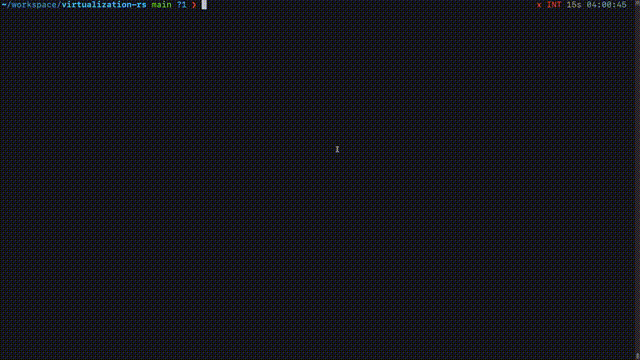

# virtualization-rs

[](https://crates.io/crates/virtualization-rs)

## Rust bindings for [Virtualization.framework](https://developer.apple.com/documentation/virtualization?language=objc)

virtualization-rs provides the API of the Apple Virtualization.framework in Rust language.

## Usage

```
[dependencies]
virtualization-rs = "0.1.0"
```

## Example

The example is inspired from [SimpleVM](https://github.com/KhaosT/SimpleVM).

```sh
make release
./target/release/examples/simplevm --kernel ubuntu/vmlinuz --initrd ubuntu/initrd --disk ubuntu/ubuntu.iso
```

